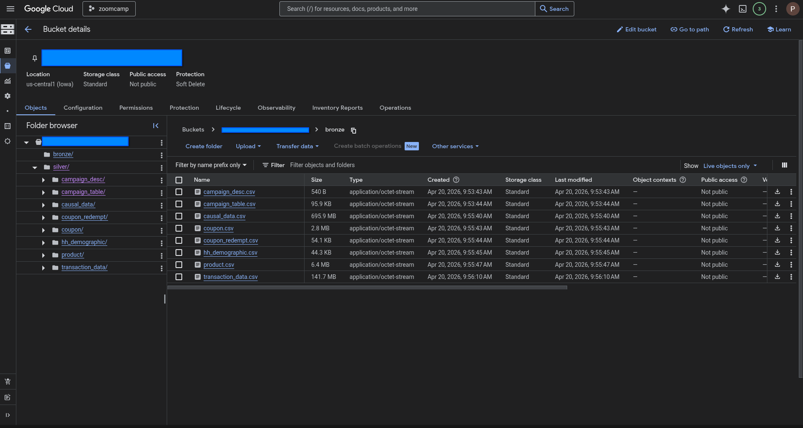
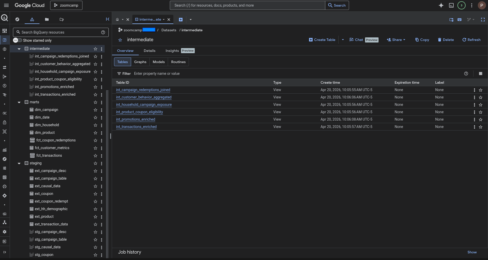

# 🛒 Retail Data Platform: The Dunnhumby Journey

**2,500 households. 2 years of daily transactions. Over 92,000 products.**
*An End-to-End ELT Pipeline transforming raw retail data into actionable insights on customer loyalty, marketing ROI, and demographic trends.*

---

## 📋 Table of Contents

1. [Problem Description](#-problem-description)
2. [The Dataset](#-the-dataset)
3. [Architecture Overview](#-architecture-overview)
4. [Project Structure](#-project-structure)
5. [Technology Stack](#-technology-stack)
6. [Reproducibility](#-reproducibility-setup--run)
7. [Storage and Modeling Results](#-storage-and-modeling-results)
8. [Orchestration Flows (Kestra)](#-orchestration-flows-kestra)
9. [Transformation & Optimization (dbt)](#-transformation--optimization-dbt)
10. [Dashboard & Insights](#-dashboard--insights)

---

## 🎯 Problem Description

### The Context: "The Complete Journey"
In the grocery retail sector, understanding customer behavior is the key to survival. To explore this, dunnhumby released **"The Complete Journey"** dataset—a comprehensive record of household-level transactions over two years (Jan 2022 - Dec 2023) from a group of frequent shoppers. Unlike typical datasets that sample only specific categories, this tracks *every single purchase* a household makes, alongside their demographic profiles and direct marketing contact history. 

### The Engineering Challenge
Extracting value from this dataset presents a significant data engineering bottleneck. In its raw form, the data is fragmented across complex, highly relational, and siloed CSV files. Querying this raw web of transactions, coupons, and campaigns directly is slow, expensive, and lacks enforced data quality rules.

### The Solution
This project builds a fully automated **ELT (Extract, Load, Transform)** pipeline to solve this issue. By orchestrating the ingestion of the Dunnhumby dataset into a Data Lake, cleansing it with distributed processing (Spark), and modeling it in a cloud Data Warehouse (BigQuery) using dbt, we create a robust analytical platform. 

This platform is specifically designed to answer the core business questions posed by the dataset:
1. **Spending Trends:** How many customers are spending more over time versus less, and which product categories are driving these shifts?
2. **Demographic Impact:** Which demographic factors (e.g., household size, presence of children, income) most strongly affect customer spend and category engagement?
3. **Marketing Effectiveness:** Is there concrete evidence to suggest that direct marketing and targeted coupons improve overall customer engagement?

---

## 📊 The Dataset

The pipeline processes the **"Dunnhumby - The Complete Journey"** dataset, automatically ingested via the [Kaggle API](https://www.kaggle.com/datasets/frtgnn/dunnhumby-the-complete-journey).

| Attribute | Details |
| :--- | :--- |
| **Domain** | Grocery Retail / Fast-Moving Consumer Goods (FMCG) |
| **Scale** | 2,500 households, 92,339 products, ~2.5 million transactions |
| **Time Window** | 2 years of daily transactional data |
| **Ingestion Method** | Automated batch download via Kaggle API |

### Core Data Entities
The raw data is contained in several key files that our pipeline unifies to build the analytical platform:

* **🛒 Transactions (`transaction_data`):** Records every item scanned at the register, prices, and discounts.
* **👥 Customer Profiles (`hh_demographic`):** Demographic data for households, including income, marital status, and household size.
* **🎯 Marketing & Coupons (`campaign_table`, `campaign_desc`, `coupon`, `coupon_redempt`):** Details of 30 marketing campaigns and the specific coupons households received and redeemed.
* **📦 Product Metadata (`product`, `causal_data`):** The store catalog and in-store features like weekly mailers or special displays.

## 🏗️ Architecture Overview

The pipeline follows a modern **ELT (Extract, Load, Transform)** pattern, fully orchestrated by Kestra and provisioned via Terraform. It moves data from raw CSVs on the web to an optimized Star Schema in BigQuery.

```text
┌─────────────────────────────────────────────────────────────┐
│  0. INFRASTRUCTURE AS CODE (Terraform)                      │
│  Provisions GCS Data Lake, BigQuery Datasets, and IAM       │
└──────────────────────────┬──────────────────────────────────┘
                           │
┌──────────────────────────▼──────────────────────────────────┐
│  1. INGESTION (Kestra Subflow)                              │
│  Kaggle API → Download & Unzip → GCS (Bronze Layer)         │
│  gs://<gcs_bucket>/bronze/*.csv                             │
└──────────────────────────┬──────────────────────────────────┘
                           │
┌──────────────────────────▼──────────────────────────────────┐
│  2. DATA LAKE PROCESSING (PySpark via Kestra)               │
│  Reads CSVs → Drops Nulls/Duplicates → Writes Parquet       │
│  gs://<gcs_bucket>/silver/*.parquet                         │
└──────────────────────────┬──────────────────────────────────┘
                           │
┌──────────────────────────▼──────────────────────────────────┐
│  3. WAREHOUSE MAPPING (BigQuery External Tables)            │
│  Maps GCS Silver Parquet files directly to BQ Staging       │
│  Dataset: <project>.staging.ext_<table>                     │
└──────────────────────────┬──────────────────────────────────┘
                           │
┌──────────────────────────▼──────────────────────────────────┐
│  4. ANALYTICAL MODELING (dbt Core via Kestra)               │
│  Staging → Intermediate → Marts                             │
│  Runs `dbt build` against BigQuery                          │
└──────────────────────────┬──────────────────────────────────┘
                           │
┌──────────────────────────▼──────────────────────────────────┐
│  5. INSIGHTS (Looker Studio / BI)                           │
│  Consumer Behavior Dashboard                                │
└─────────────────────────────────────────────────────────────┘
```
## 📁 Project Structure

```text
dunnhumby-retail-pipeline/
├── dbt/
│   └── zoomcamp/                        # dbt project root
│       ├── dbt_project.yml
│       ├── macros/                      # Reusable SQL macros
│       │   ├── calculate_total_discount.sql
│       │   ├── generate_schema_name.sql
│       │   ├── get_promotion_flag.sql
│       │   └── safe_divide.sql
│       └── models/
│           ├── staging/                 # Raw source cleaning layer
│           │   ├── sources.yml
│           │   ├── stg_models.yml
│           │   ├── stg_campaign_desc.sql
│           │   ├── stg_campaign_table.sql
│           │   ├── stg_causal_data.sql
│           │   ├── stg_coupon.sql
│           │   ├── stg_coupon_redempt.sql
│           │   ├── stg_hh_demographic.sql
│           │   ├── stg_product.sql
│           │   └── stg_transaction_data.sql
│           ├── intermediate/            # Business logic & joins
│           │   ├── schema.yml
│           │   ├── int_campaign_redemptions_joined.sql
│           │   ├── int_customer_behavior_aggregated.sql
│           │   ├── int_household_campaign_exposure.sql
│           │   ├── int_product_coupon_eligibility.sql
│           │   ├── int_promotions_enriched.sql
│           │   └── int_transactions_enriched.sql
│           └── marts/                   # Analytical star schema
│               ├── schema.yml
│               ├── dim_campaign.sql
│               ├── dim_date.sql
│               ├── dim_household.sql
│               ├── dim_product.sql
│               ├── fct_coupon_redemptions.sql
│               ├── fct_customer_metrics.sql
│               └── fct_transactions.sql
├── docs/
│   └── images/                          # README screenshots
├── keys/                                # GCP credentials (git-ignored)
├── orchestration/
│   ├── docker-compose.yml               # Kestra + Postgres setup
│   └── flows/                           # Kestra flow definitions
│       ├── main_zoomcamp_init_gcp_kv.yml
│       ├── main_zoomcamp_data_sources_ingestion.yml
│       ├── main_zoomcamp_distributed_data_cleansing.yml
│       ├── main_zoomcamp_warehouse_schema_mapping.yml
│       ├── main_zoomcamp_analytical_model_transformation.yml
│       └── main_zoomcamp_end_to_end_pipeline.yml
├── terraform/                           # Infrastructure as Code
│   ├── main.tf
│   ├── variables.tf
│   ├── outputs.tf
│   ├── providers.tf
│   ├── versions.tf
│   └── terraform.tfvars.example
├── pyproject.toml
├── uv.lock
└── README.md
```

## 🛠️ Technology Stack

| Layer | Technology |
| :--- | :--- |
| **Cloud** | Google Cloud Platform (GCP) |
| **Infrastructure as Code** | Terraform |
| **Orchestration** | Kestra v1.1 (Docker) |
| **Ingestion** | Kaggle API + Bash (`wget`, `unzip`) |
| **Compute / Processing** | PySpark (Containerized) |
| **Data Lake** | Google Cloud Storage (GCS) |
| **Data Warehouse** | Google BigQuery |
| **Transformation** | dbt (`dbt-bigquery:1.9.0`) |
| **Dashboard** | Looker Studio |
| **Language** | Python 3.11, SQL |
| **Package Manager** | uv |

## 🚀 Reproducibility (Setup & Run)

This project has been heavily optimized for easy deployment. Everything is managed via Infrastructure as Code (Terraform) and orchestrated completely inside Docker (Kestra). There is **no need** to manually install Spark, dbt, or configure complex cloud jobs.

---

## Prerequisites

Ensure your local environment or VM meets the following requirements:

- [Google Cloud SDK (gcloud CLI)](https://cloud.google.com/sdk/docs/install) — installed and authenticated
- [Terraform](https://developer.hashicorp.com/terraform/downloads) — version >= 1.3.0
- [Docker Engine](https://docs.docker.com/engine/install/) & [Docker Compose](https://docs.docker.com/compose/install/) — installed and running
- A GCP project with billing enabled

---

## Step 1 — Clone the Repository

Clone the project to your local machine and navigate into the directory:

```bash
git clone https://github.com/picantitoDev/dunnhumby-retail-pipeline.git
cd dunnhumby-retail-pipeline
```

---

## Step 2 — GCP Authentication

Before provisioning infrastructure, authenticate your local environment with Google Cloud so Terraform has the necessary permissions:

```bash
# Login with your Google account
gcloud auth login

# Set application default credentials
gcloud auth application-default login

# Set your GCP project
gcloud config set project <your-project-id>
gcloud auth application-default set-quota-project <your-project-id>
```

---

## Step 3 — Provision Infrastructure (Terraform)

Terraform will automatically create:

- A **GCS Data Lake** bucket
- **BigQuery datasets** (`staging`, `intermediate`, `marts`)
- A dedicated **Service Account** with the correct IAM roles

Navigate to the `terraform` folder and copy the variables template:

```bash
cd terraform
cp terraform.tfvars.example terraform.tfvars
```

Edit `terraform.tfvars` with your specific GCP details:

```hcl
# terraform.tfvars
project_id = "my-gcp-project-12345"
region     = "us-central1"
gcs_bucket = "my-dunnhumby-datalake-prod"
```

Initialize and deploy the infrastructure:

```bash
terraform init
terraform plan
terraform apply --auto-approve
```

> **Note:** This process automatically generates a secure Service Account key and saves it to `../keys/google-creds.json`.

---

## Step 4 — Configure Orchestration (Docker & Kestra)

Navigate to the `orchestration` folder and copy the environment template:

```bash
cd ../orchestration
cp .env.example .env
```

Edit the `.env` file to match the resources Terraform just created:

```env
# Kestra Admin Credentials
KESTRA_ADMIN_USER=your-admin-email@example.com
KESTRA_ADMIN_PASSWORD=your-admin-password

# Google Cloud Configuration
KESTRA_GCP_PROJECT_ID=your-gcp-project-id
KESTRA_GCP_LOCATION=your-gcp-region
KESTRA_GCP_BUCKET_NAME=your-gcs-bucket-name

# BigQuery Datasets
KESTRA_GCP_DATASET_STAGING=staging
KESTRA_GCP_DATASET_INTERMEDIATE=intermediate
KESTRA_GCP_DATASET_MARTS=marts
```

**Inject GCP Credentials into Kestra:** Run the following command inside `/orchestration` to encode the Google JSON credentials (generated by Terraform) into base64 and append them to your `.env` file as a Kestra secret:

```bash
echo -e "\nSECRET_GCP_SERVICE_ACCOUNT=$(cat ../keys/google-creds.json | base64 -w 0)" >> .env
```

---

## Step 5 — Run the Pipeline

Everything is configured. Boot up the Kestra orchestrator:

```bash
docker compose up -d
```

Once the containers are running:

1. Open your browser and go to the **Kestra UI**:  
   http://localhost:8080  

2. Log in with the email and password you configured earlier.

3. Navigate to **Flows** in the left sidebar.

4. Select the `end_to_end_pipeline` flow.

   

5. Click **Execute** and watch the pipeline start.

   
## 🗄️ Storage and Modeling Results
By utilizing PySpark for data cleansing, the raw datasets were successfully transformed into partitioned Parquet files within the Data Lake:

 

Subsequently, dbt was used to orchestrate the modeling process within BigQuery, building out the star schema across staging, intermediate, and analytical (marts) datasets:



## 🧩 Orchestration Flows (Kestra)

To ensure modularity, fault tolerance, and easy debugging, the pipeline is divided into specialized Kestra flows. By avoiding a monolithic script, we can retry specific tasks (like ingestion) without re-running expensive compute jobs (like Spark).

---

### Flow Overview

| # | Flow ID | Purpose |
| :---: | :--- | :--- |
| 1 | `init_gcp_kv` | Loads environment variables into Kestra's KV store |
| 2 | `data_sources_ingestion` | Downloads dataset from Kaggle and uploads CSVs to GCS Bronze layer |
| 3 | `distributed_data_cleansing` | Runs PySpark to clean data and write Parquet to GCS Silver layer |
| 4 | `warehouse_schema_mapping` | Creates BigQuery external tables from Silver Parquet files |
| 5 | `analytical_model_transformation` | Runs `dbt build` to execute all staging, intermediate, and mart models |
| 6 | `end_to_end_pipeline` | Master orchestrator that chains all subflows with retry logic |

---

### 1. Configuration Bootstrap (`init_gcp_kv`)

Securely loads environment variables (Project ID, Locations, Buckets) into Kestra's internal Key-Value (KV) store. This ensures all subsequent flows are completely dynamic and parameterized.

<details>
<summary><b>View Source Code (YAML)</b></summary>

```yaml
id: init_gcp_kv
namespace: zoomcamp
description: Initialize Google Cloud configuration values in Kestra key-value storage using global variables.

tasks:
  - id: gcp_project_id
    type: io.kestra.plugin.core.kv.Set
    key: GCP_PROJECT_ID
    kvType: STRING
    value: "{{ envs.gcp_project_id }}"

  - id: gcp_location
    type: io.kestra.plugin.core.kv.Set
    key: GCP_LOCATION
    kvType: STRING
    value: "{{ envs.gcp_location }}"

  - id: gcp_bucket_name
    type: io.kestra.plugin.core.kv.Set
    key: GCP_BUCKET_NAME
    kvType: STRING
    value: "{{ envs.gcp_bucket_name }}"

  - id: gcp_dataset_staging
    type: io.kestra.plugin.core.kv.Set
    key: GCP_DATASET_STAGING
    kvType: STRING
    value: "{{ envs.gcp_dataset_staging }}"

  - id: gcp_dataset_intermediate
    type: io.kestra.plugin.core.kv.Set
    key: GCP_DATASET_INTERMEDIATE
    kvType: STRING
    value: "{{ envs.gcp_dataset_intermediate }}"

  - id: gcp_dataset_marts
    type: io.kestra.plugin.core.kv.Set
    key: GCP_DATASET_MARTS
    kvType: STRING
    value: "{{ envs.gcp_dataset_marts }}"
```

</details>

---

### 2. Data Ingestion (`data_sources_ingestion`)

Authenticates with the Kaggle API, downloads the `dunnhumby.zip` file, unzips it within a container, and concurrently uploads the raw `.csv` files directly to the GCS `bronze/` layer using a `ForEach` loop.

<details>
<summary><b>View Source Code (YAML)</b></summary>

```yaml
id: data_sources_ingestion
namespace: zoomcamp
description: Download the Dunnhumby dataset and upload raw CSV files to GCS

variables:
  bucket: "{{ kv('GCP_BUCKET_NAME') }}"
  tables:
    - campaign_desc
    - campaign_table
    - causal_data
    - coupon
    - coupon_redempt
    - hh_demographic
    - product
    - transaction_data

tasks:
  - id: extract
    type: io.kestra.plugin.scripts.shell.Commands
    taskRunner:
      type: io.kestra.plugin.core.runner.Process
    containerImage: python:3.11-slim
    outputFiles:
      - "*.csv"
    commands:
      - |
        echo "--- Installing dependencies ---"
        apt-get update
        apt-get install -y wget unzip

        echo "--- Downloading dataset ---"
        wget -O dunnhumby.zip \
          https://www.kaggle.com/api/v1/datasets/download/frtgnn/dunnhumby-the-complete-journey

        echo "--- Extracting files ---"
        unzip dunnhumby.zip

        echo "--- Listing extracted files ---"
        ls -lah

  - id: upload_to_gcs
    type: io.kestra.plugin.core.flow.ForEach
    values: "{{ vars.tables }}"
    tasks:
      - id: upload
        type: io.kestra.plugin.gcp.gcs.Upload
        from: "{{ outputs.extract.outputFiles[taskrun.value ~ '.csv'] }}"
        to: "gs://{{ vars.bucket }}/bronze/{{ taskrun.value }}.csv"

pluginDefaults:
  - type: io.kestra.plugin.gcp
    values:
      serviceAccount: "{{ secret('GCP_SERVICE_ACCOUNT') }}"
      projectId: "{{ kv('GCP_PROJECT_ID') }}"
      location: "{{ kv('GCP_LOCATION') }}"
```

</details>

---

### 3. Data Lake Processing (`distributed_data_cleansing`)

Spins up a PySpark environment, reads the raw CSVs from the Bronze layer, enforces schema inference, drops nulls and duplicates, and writes compressed Parquet files to the `silver/` layer.

<details>
<summary><b>View Source Code (YAML)</b></summary>

```yaml
id: distributed_data_cleansing
namespace: zoomcamp
description: Process raw CSV files from Google Cloud Storage with Spark and write cleaned Parquet files to the silver layer.

tasks:
  - id: run_spark_silver
    type: io.kestra.plugin.scripts.python.Script
    containerImage: python:3.11-slim
    taskRunner:
      type: io.kestra.plugin.scripts.runner.docker.Docker
      user: "root"
      memory:
        memory: "8GB"
        memoryReservation: "6GB"
        memorySwap: "8GB"
    env:
      GCP_BUCKET: "{{ kv('GCP_BUCKET_NAME') }}"
      JAVA_HOME: /usr/lib/jvm/default-java
      GOOGLE_APPLICATION_CREDENTIALS: "gcp-key.json"
    inputFiles:
      gcp-key.json: "{{ secret('GCP_SERVICE_ACCOUNT') }}"
    beforeCommands:
      - apt-get update
      - apt-get install -y default-jdk
      - pip install pyspark google-cloud-storage
    script: |
      import os
      import sys
      from pyspark.sql import SparkSession

      key_path = os.environ["GOOGLE_APPLICATION_CREDENTIALS"]
      bucket = os.environ["GCP_BUCKET"]

      tables = [
          "campaign_desc", "campaign_table", "causal_data",
          "coupon", "coupon_redempt", "hh_demographic",
          "product", "transaction_data"
      ]

      spark = (
          SparkSession.builder
          .appName("Dunnhumby-Silver-Processing")
          .config("spark.jars.packages", "com.google.cloud.bigdataoss:gcs-connector:hadoop3-2.2.15")
          .config("spark.hadoop.fs.gs.impl", "com.google.cloud.hadoop.fs.gcs.GoogleHadoopFileSystem")
          .config("spark.hadoop.fs.AbstractFileSystem.gs.impl", "com.google.cloud.hadoop.fs.gcs.GoogleHadoopFS")
          .config("spark.hadoop.google.cloud.auth.service.account.enable", "true")
          .config("spark.hadoop.google.cloud.auth.service.account.json.keyfile", key_path)
          .config("spark.driver.memory", "6g")
          .config("spark.executor.memory", "6g")
          .config("spark.sql.shuffle.partitions", "4")
          .getOrCreate()
      )

      failed_tables = []

      for table in tables:
          try:
              print(f"--- Processing table: {table} ---")
              df = spark.read.option("header", "true").option("inferSchema", "true").csv(f"gs://{bucket}/bronze/{table}.csv")
              df_clean = df.dropna(how="all").dropDuplicates()
              df_clean.write.mode("overwrite").parquet(f"gs://{bucket}/silver/{table}")
              spark.catalog.clearCache()
          except Exception as e:
              print(f"Failed table {table}: {str(e)}")
              failed_tables.append(table)

      spark.stop()

      if failed_tables:
          raise RuntimeError(f"Processing failed for tables: {', '.join(failed_tables)}")
```

</details>

---

### 4. Data Warehouse Bridge (`warehouse_schema_mapping`)

Acts as the bridge between the Data Lake and the Data Warehouse. It uses a Jinja loop to execute `CREATE OR REPLACE EXTERNAL TABLE` queries in BigQuery, directly referencing the Silver Parquet files in GCS without duplicating storage costs.

<details>
<summary><b>View Source Code (YAML)</b></summary>

```yaml
id: warehouse_schema_mapping
namespace: zoomcamp
description: Create or replace BigQuery external tables from Parquet files stored in the silver layer in Google Cloud Storage.

tasks:
  - id: create_bigquery_external_tables
    type: io.kestra.plugin.gcp.bigquery.Query
    projectId: "{{ kv('GCP_PROJECT_ID') }}"
    serviceAccount: "{{ secret('GCP_SERVICE_ACCOUNT') }}"
    sql: |
      

      
      CREATE OR REPLACE EXTERNAL TABLE
      `{{ kv('GCP_PROJECT_ID') }}.{{ kv('GCP_DATASET_STAGING') }}.ext_{{ table }}`
      OPTIONS (
        format = 'PARQUET',
        uris = ['gs://{{ kv('GCP_BUCKET_NAME') }}/silver/{{ table }}/*.parquet']
      );
      
```

</details>

---

### 5. Analytical Modeling (`analytical_model_transformation`)

Executes the ELT transformations by spinning up a `dbt-bigquery` container, dynamically generating `profiles.yml` using Kestra's KV store, and running `dbt build` to execute all staging, intermediate, and marts models.

<details>
<summary><b>View Source Code (YAML)</b></summary>

```yaml
id: analytical_model_transformation
namespace: zoomcamp
description: Clone the repository and build the data warehouse with dbt in BigQuery.

tasks:
  - id: execute_dbt_models
    type: io.kestra.plugin.scripts.shell.Commands
    taskRunner:
      type: io.kestra.plugin.scripts.runner.docker.Docker
    containerImage: ghcr.io/dbt-labs/dbt-bigquery:1.9.0
    inputFiles:
      gcp-key.json: "{{ secret('GCP_SERVICE_ACCOUNT') }}"
    commands:
      - |
        echo "--- Cloning repository ---"
        rm -rf repo
        git clone https://github.com/picantitoDev/COVID-Mobility-Patterns.git repo

        cd repo/dbt/zoomcamp

        echo "--- Creating dbt profile ---"
        mkdir -p ~/.dbt

        cat <<EOF > ~/.dbt/profiles.yml
        zoomcamp:
          outputs:
            dev:
              type: bigquery
              method: service-account
              project: {{ kv('GCP_PROJECT_ID') }}
              dataset: {{ kv('GCP_DATASET_STAGING') }}
              threads: 4
              keyfile: "{{ workingDir }}/gcp-key.json"
              location: {{ kv('GCP_LOCATION') }}
              priority: interactive
          target: dev
        EOF

        echo "--- Installing dependencies ---"
        dbt deps

        echo "--- Testing BigQuery connection ---"
        dbt debug

        echo "--- Building data warehouse ---"
        dbt build --target dev
```

</details>

---

### 6. Master Orchestrator (`end_to_end_pipeline`)

The parent flow that strings all subflows together with strict `wait: true` dependencies. It includes a daily cron schedule (`0 5 * * *`), retry blocks for API and network resilience, and a failure alert catcher.

<details>
<summary><b>View Source Code (YAML)</b></summary>

```yaml
id: end_to_end_pipeline
namespace: zoomcamp
description: Central orchestration workflow for the Dunnhumby Retail pipeline. Executes ingestion, Spark processing, external table creation, and dbt transformations.

triggers:
  - id: daily_pipeline_schedule
    type: io.kestra.plugin.core.trigger.Schedule
    cron: "0 5 * * *"
    disabled: false

tasks:
  - id: bootstrap_configuration
    type: io.kestra.plugin.core.flow.Subflow
    namespace: zoomcamp
    flowId: init_gcp_kv
    wait: true
    transmitFailed: true

  - id: data_ingestion
    type: io.kestra.plugin.core.flow.Subflow
    namespace: zoomcamp
    flowId: data_sources_ingestion
    wait: true
    transmitFailed: true
    retry:
      type: constant
      interval: PT2M
      maxAttempt: 3

  - id: distributed_cleansing
    type: io.kestra.plugin.core.flow.Subflow
    namespace: zoomcamp
    flowId: distributed_data_cleansing
    wait: true
    transmitFailed: true
    retry:
      type: constant
      interval: PT5M
      maxAttempt: 2

  - id: schema_mapping
    type: io.kestra.plugin.core.flow.Subflow
    namespace: zoomcamp
    flowId: warehouse_schema_mapping
    wait: true
    transmitFailed: true

  - id: analytical_modeling
    type: io.kestra.plugin.core.flow.Subflow
    namespace: zoomcamp
    flowId: analytical_model_transformation
    wait: true
    transmitFailed: true
    retry:
      type: constant
      interval: PT1M
      maxAttempt: 2

errors:
  - id: alert_on_failure
    type: io.kestra.plugin.scripts.shell.Commands
    taskRunner:
      type: io.kestra.plugin.core.runner.Process
    commands:
      - echo "Pipeline failed at the exec {{ execution.id }}."
```

</details>

---

## 💎 Transformation & Optimization (dbt)

The transformation layer goes beyond simple data joining — it is explicitly designed to minimize BigQuery scan costs and maximize query performance for the Looker Studio dashboard, leveraging dbt's configuration blocks to enforce **Partitioning** and **Clustering** across all high-volume mart tables.

### Partitioning & Clustering

| Table | Partitioned By | Clustered By |
| :--- | :--- | :--- |
| `fct_transactions` | `transaction_date` (day) | `department_name`, `household_id` |
| `fct_coupon_redemptions` | `redemption_date` (day) | `campaign_id` |
| `fct_customer_metrics` | — | `household_id` |
| `dim_household` | — | `income_range` |

### Dynamic Date Normalization

The raw dataset uses relative integer days (Day 1, Day 2, ...) rather than real calendar dates. All dbt models convert these into standard `DATE` types using `date_add` from a `2022-01-01` baseline, making them fully compatible with BI tools.

## 📈 Dashboard & Insights

The final layer of the pipeline is a Looker Studio dashboard connected directly to the BigQuery marts dataset.  
The visual layer was specifically designed to answer the core business questions established at the beginning of the project.

#### 👉 [View the Live Dashboard](https://datastudio.google.com/reporting/34c1f096-a007-479d-a6f7-1dce234a04d8)
---

### 1. Spending Trends

The dashboard tracks **Total Revenue** and net sales over time, showing a steady growth pattern with significant seasonal peaks.  
We also identified which product categories (e.g., *Grocery*, *Drug GM*) are driving the most reliable revenue.


---

### 2. Demographic Impact & Marketing Effectiveness

By joining customer metrics with household dimensions, we clearly visualize how higher `income_range` correlates with overall spend.  
Additionally, the data provides strong evidence of the impact of direct mail marketing.


